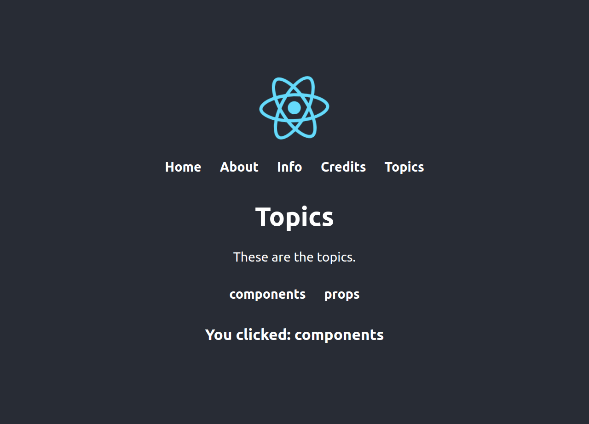

# react-router

This page was created by Stefan Klinkusch at Digital Career Institute in Berlin, Germany using React.js.

## Steps
- create a React project with `npx create-react-app react-router`
- install the React-router-DOM package with `npm i react-router-dom`
- reduce the size of the logo
- clean up the remaining default file entry
- create a navigation bar in `Navbar.js` and import it to `App.js`
- import `BrowserRouter` in `App.js` and wrap the whole returned content in it
- import `Link` in `Navbar.js` and generate `<Link>` tags for each navbar item
- make a dummy text for each component (`Home`, `About`, `Info`, `Credits`) in the respective `.js` file
- import `Route` in `App.js`
- import all components in `App.js` using `<Route>` tags
- make a splash screen using `<Route render={() => <h1>Welcome</h1>}>`
- add a new Component `<Topics>`, link it in `Navbar.js`, and use it
- make a second navbar in `Topics.js`, use `{match}` in `<Link>`, `<Route>`, and the `Topic` function
- `{match}` is used in class components as `{this.props.match}`
- make a page for pages that are not found using the `<Switch>` statement
- transform `<Link>` to `<NavLink>`
- highlight the active `<NavLink>` using the `activeClassName` argument

## Screenshot

